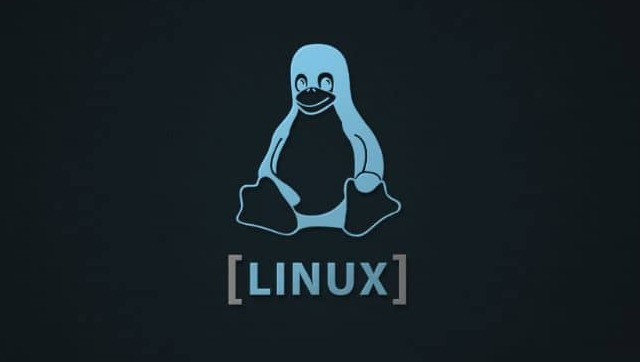

# Linux

<!-- Logo image -->

[Pytopia](https://www.pytopia.ai) Linux Course Material (for Python and Data Science purposes). Including:

- Linux Fundametals
- Linux Terminal
- Linux File Systems
- Bash Shell Scripting

To register for the courses, visit the [Pytopia Website](https://www.pytopia.ai/).
